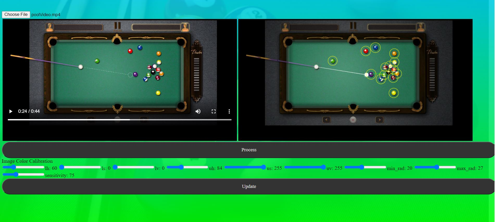
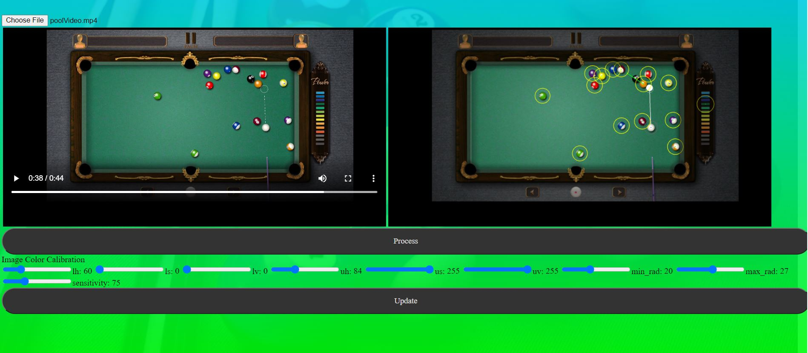

# Pool-Game-Path-predictor

Step 1: Download the repository and install python3 with pip on your system. 
Step 2: Run the cmd: $pip install -r requirements.txt 
Step 3: Run the cmd: $python run.py 
Step 4: Now you can access the webapp at http://127.0.0.1:5000/ 

# Webapp screenshots

